## Level 1

### Logical View

### Implementation View

### Process View

#### POST

#### GET

#### PATCH

---

### Level 2

#### Logical View

#### Implementation View

#### Process View

##### POST

##### GET

##### PATCH

---

#### Logical View - Data Administration Module

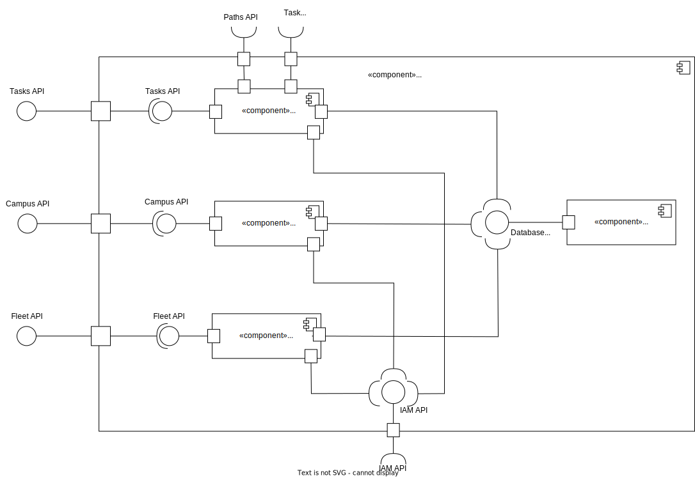

#### Implementation View - Data Administration Module

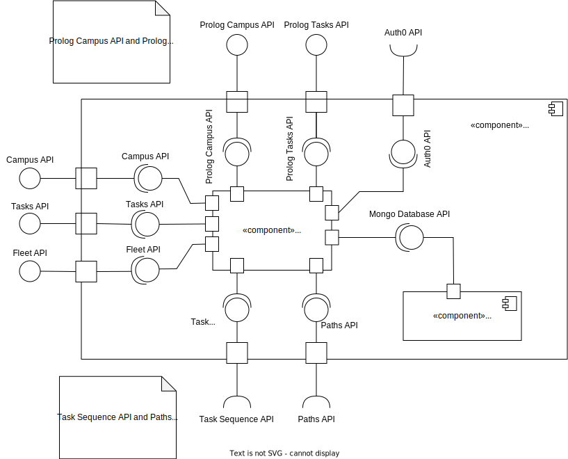

#### Process View - Data Administration Module

##### POST - Building
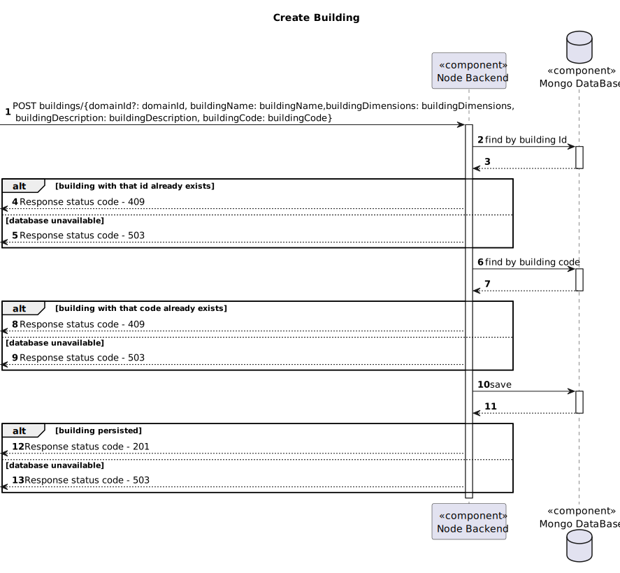

##### POST - Robisep
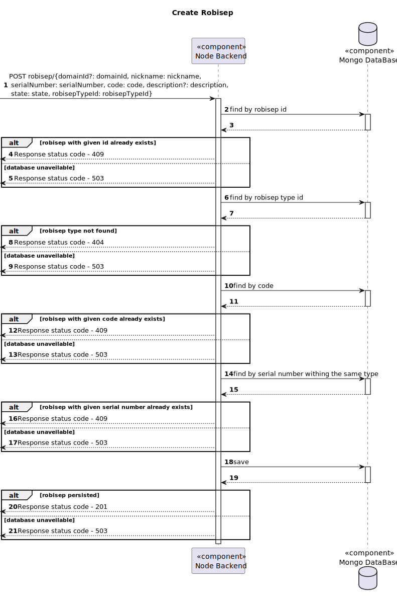

##### POST - Passage
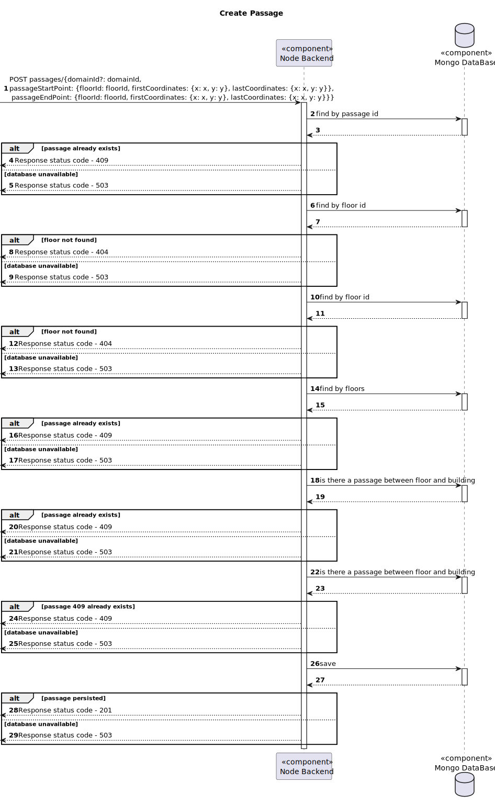

#### PATCH - Elevator
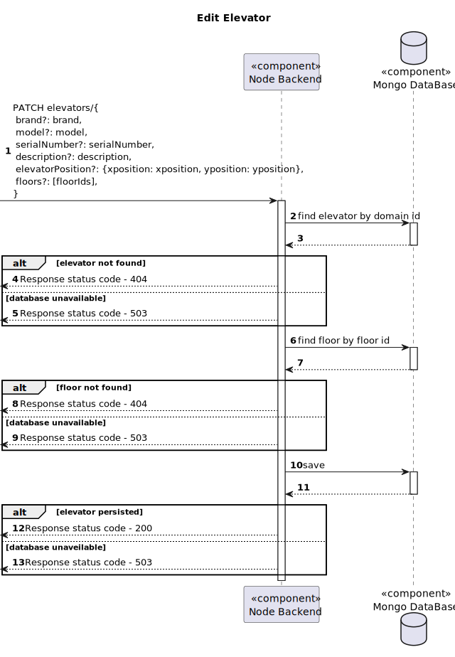

#### PATCH - Floor
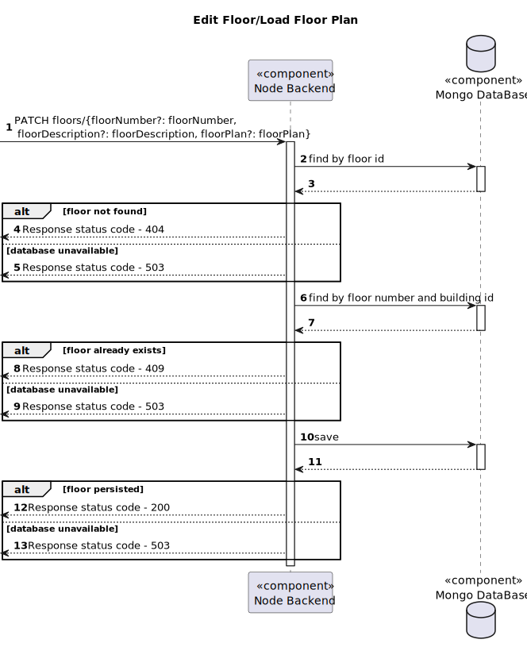

#### PATCH - Passage
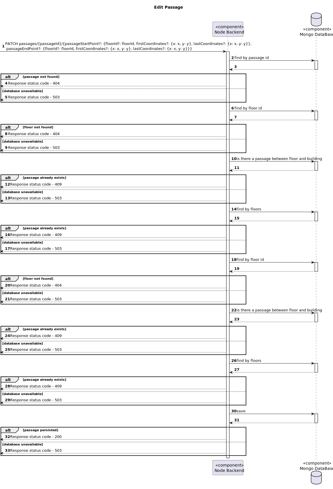

##### PATCH - Robisep
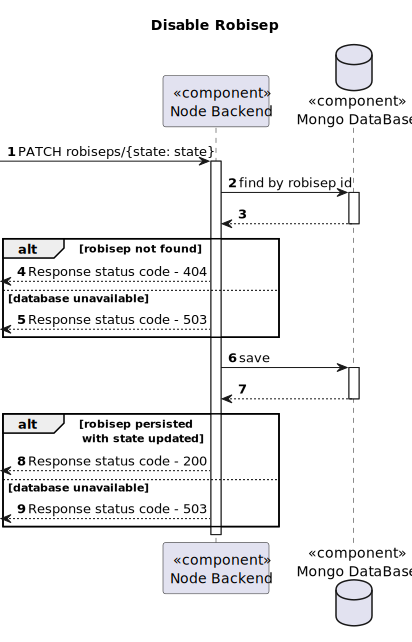

##### GET - Robisep
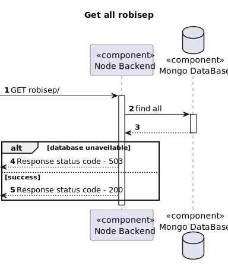

##### GET - Passage
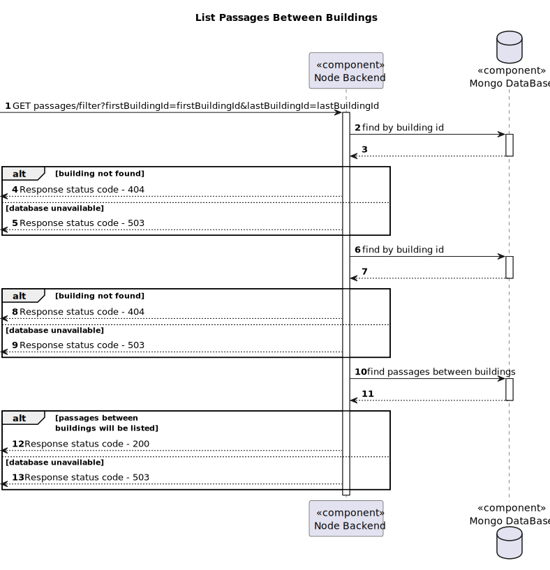

##### GET - Task Sequence
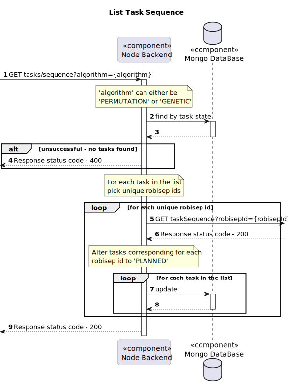
