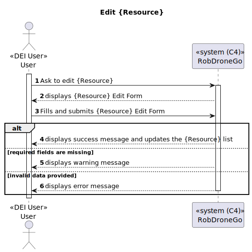

## Level 1

### Logical View

### Implementation View

### Process View

#### POST

#### GET

#### PATCH

---

### Level 2

#### Logical View

#### Implementation View

#### Process View

##### POST

##### GET

##### PATCH

---

#### Logical View - Data Administration Module

#### Implementation View - Data Administration Module

#### Process View - Data Administration Module

##### POST - Building

##### POST - Robisep

##### POST - Passage

#### PATCH - Elevator

#### PATCH - Floor

#### PATCH - Passage

##### PATCH - Robisep

##### GET - Robisep

##### GET - Passage

##### GET - Task Sequence

