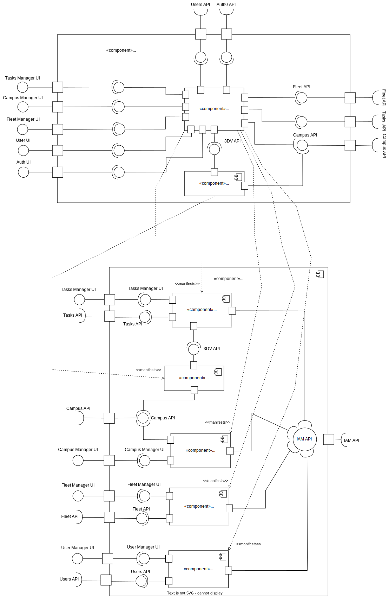
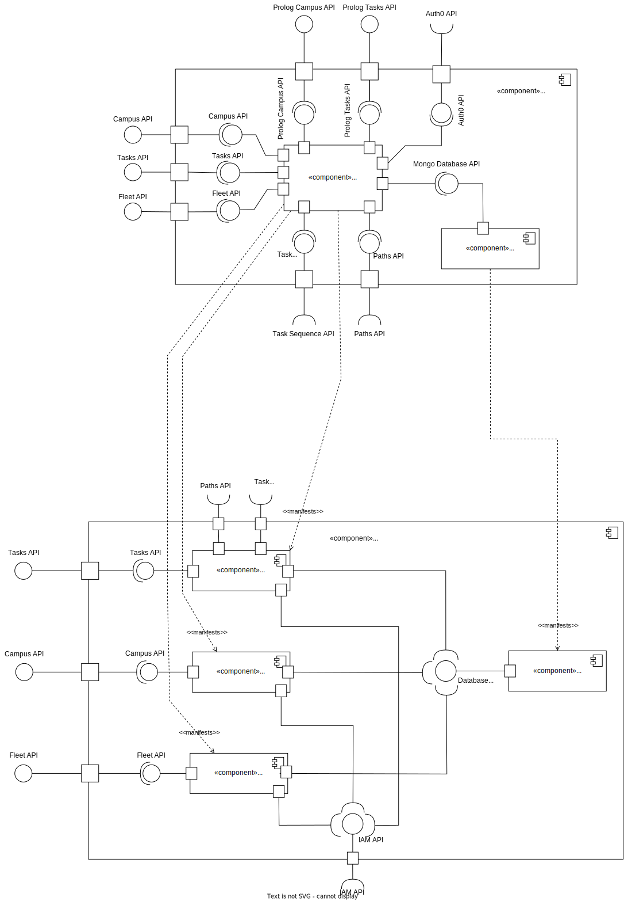
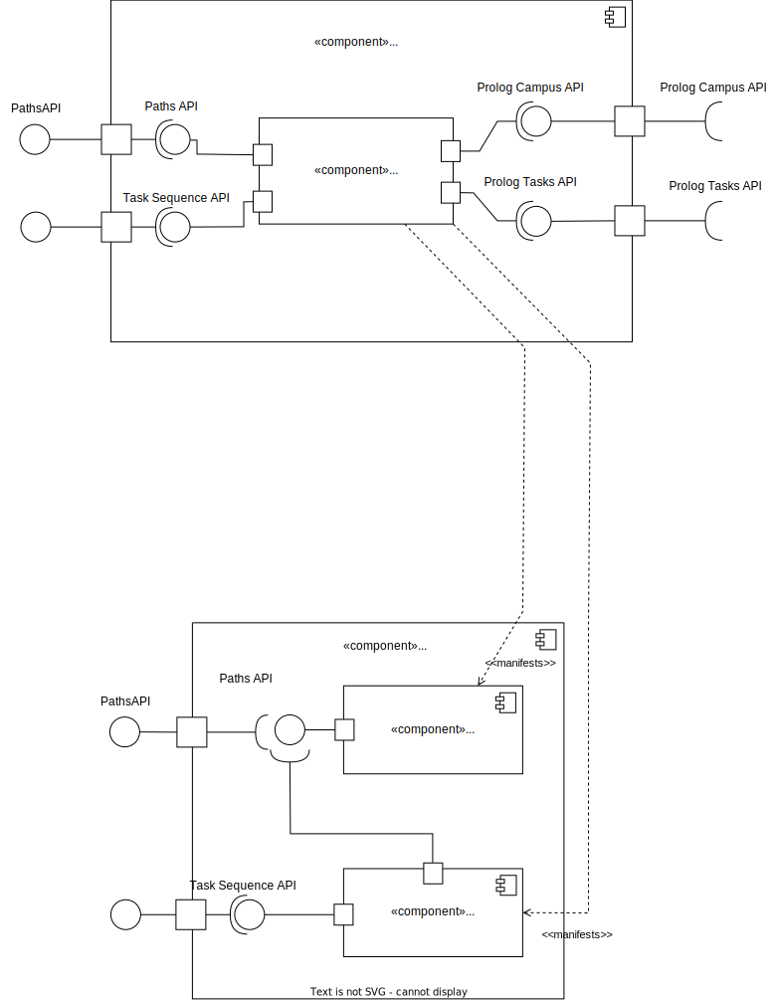
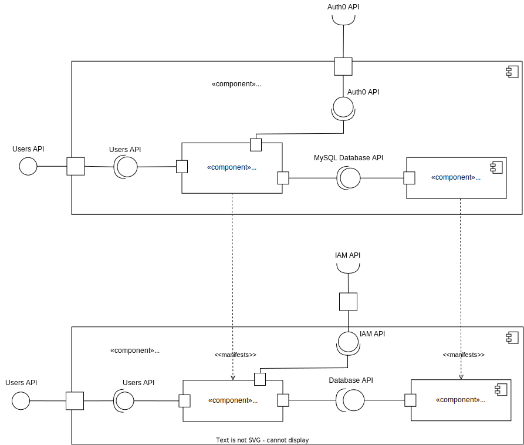

# Mapping Between View

## Level 2 (Implementation View - Logical View)

## Level 3 RobDroneGo Portal Module (Implementation View - Logical View)

## Level 3 Data Administration Module (Implementation View - Logical View)

## Level 3 Planning Module (Implementation View - Logical View)

## Level 3 User Management Module (Implementation View - Logical View)

