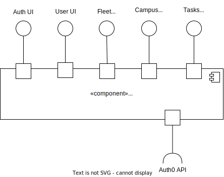
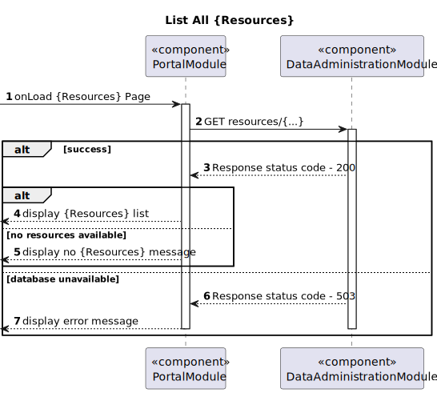

## Level 1

### Logical View

### Implementation View

### Process View

#### POST

#### GET

#### PATCH

---

### Level 2

#### Logical View

#### Implementation View

#### Process View

##### POST

##### GET

##### PATCH

---

#### Logical View - Planning Module

#### Implementation View - Planning Module

#### Process View - Planning Module

##### List - Paths

##### List - Task Sequence

