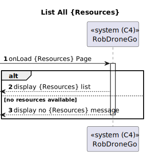
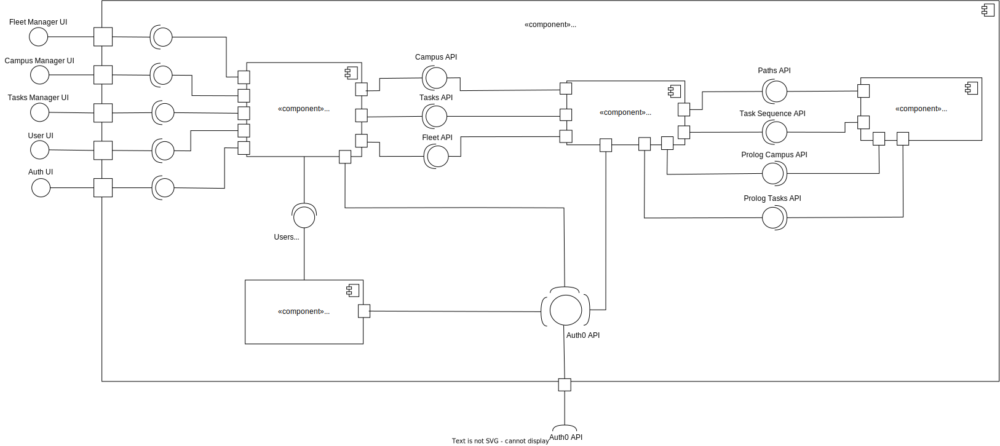

## Level 1

### Logical View

### Implementation View

### Process View

#### POST

#### GET

#### PATCH

---

### Level 2

#### Logical View

#### Implementation View

#### Process View

##### POST

##### GET

##### PATCH

---

### Level 3

#### Logical View - RobDroneGo Portal Module

#### Implementation View - RobDroneGo Portal Module

#### Process View - RobDroneGo Portal Module

##### List All

##### List Filter

##### Edit

##### Create

