## Level 1

### Logical View

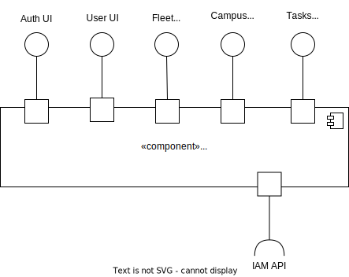

### Implementation View

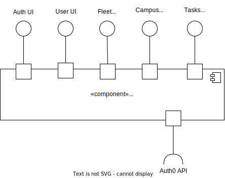

### Process View

#### POST
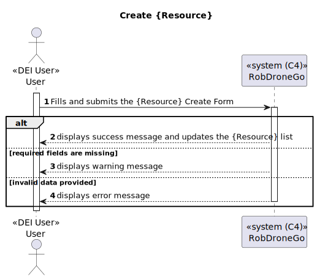

#### GET
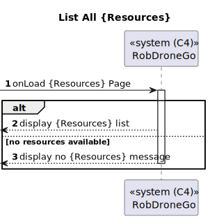

#### PATCH
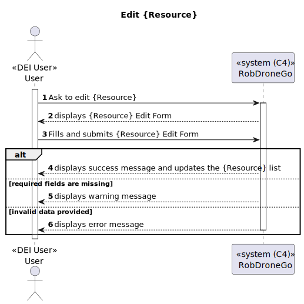

##### CREATE BACKOFFICE USER
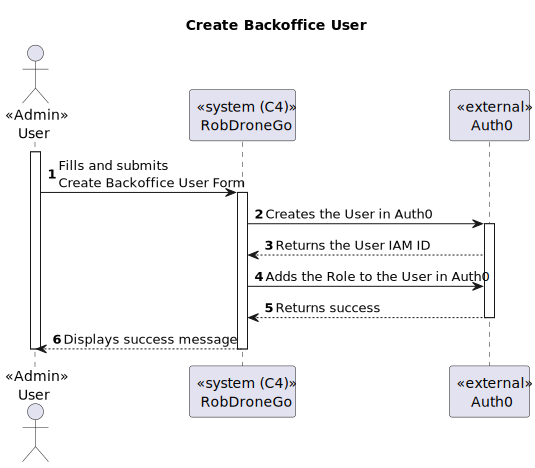

##### CREATE SIGNUP REQUEST
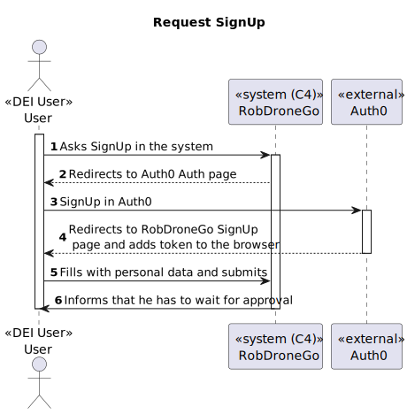

##### APPROVE SIGNUP REQUEST
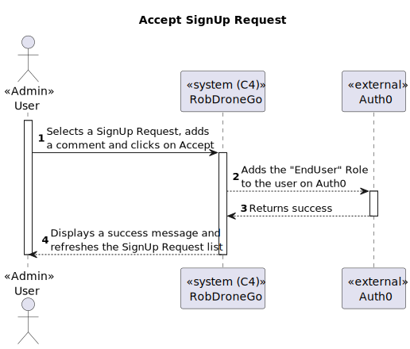

##### LOGIN
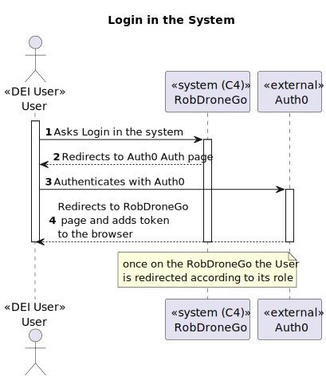

---

### Level 2

#### Logical View


#### Implementation View

#### Process View

##### POST
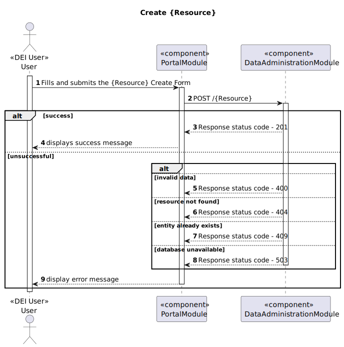

##### GET
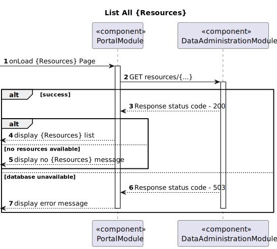

##### PATCH
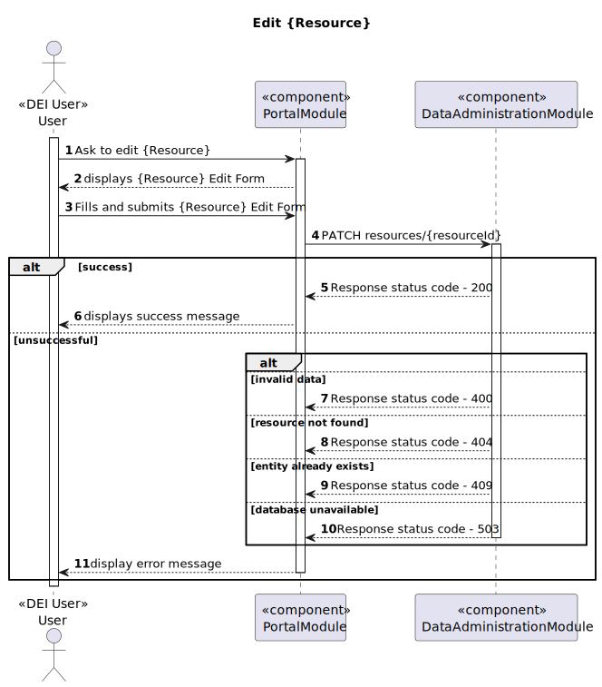

##### CREATE BACKOFFICE USER
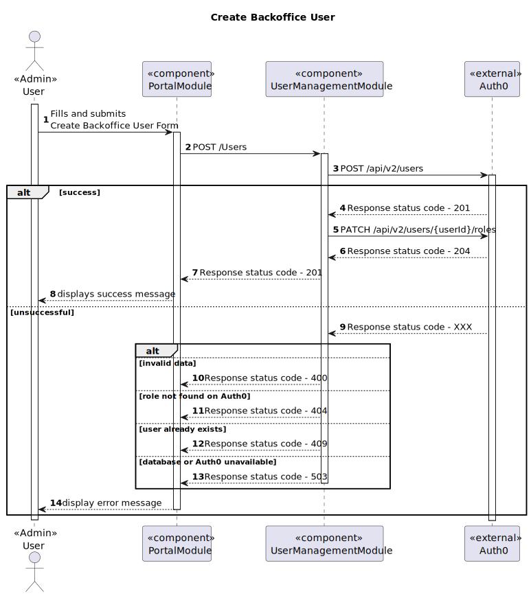

##### ACCEPT SIGNUP REQUEST
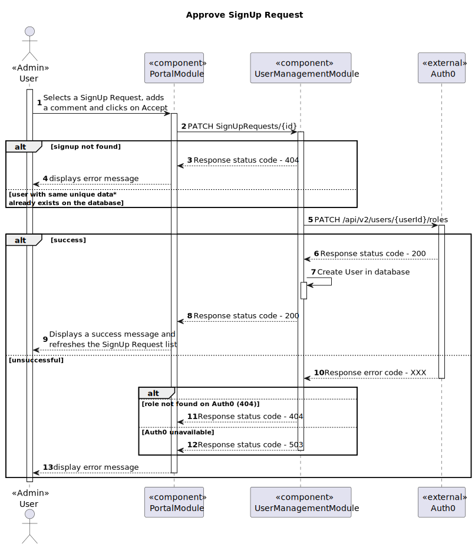

---

### Level 3

#### Logical View - User Management Module

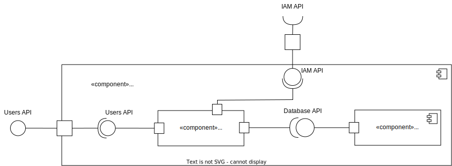

#### Implementation View - User Management Module

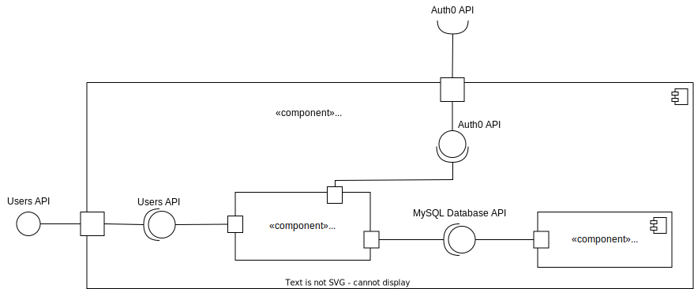

#### Process View - User Management Module

##### CREATE BACKOFFICE USER
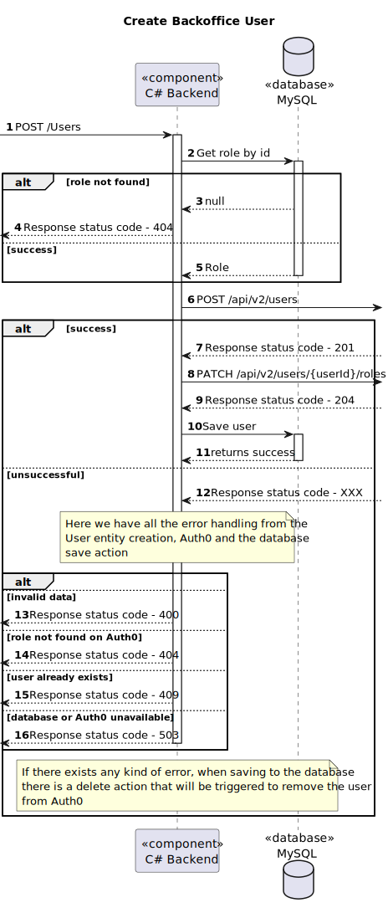

##### ACCEPT SIGNUP REQUEST
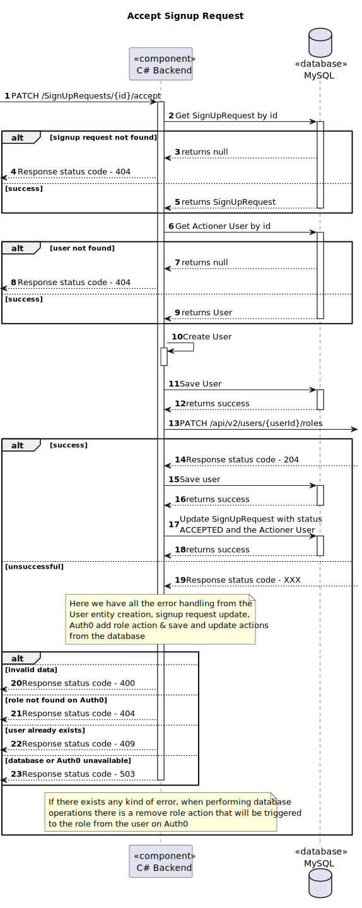