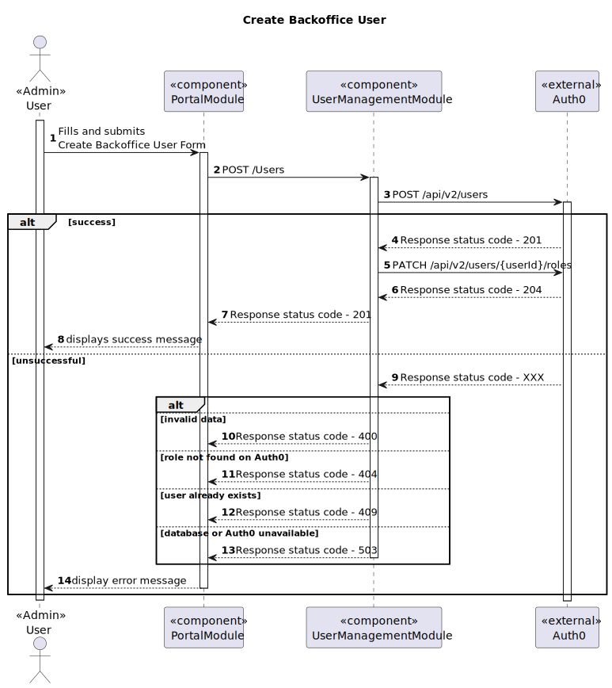

## Level 1

### Logical View

### Implementation View

### Process View

#### POST

#### GET

#### PATCH

##### CREATE BACKOFFICE USER

##### CREATE SIGNUP REQUEST

##### APPROVE SIGNUP REQUEST

##### LOGIN

---

### Level 2

#### Logical View

#### Implementation View

#### Process View

##### POST

##### GET

##### PATCH

##### CREATE BACKOFFICE USER

##### ACCEPT SIGNUP REQUEST

---

### Level 3

#### Logical View - User Management Module

#### Implementation View - User Management Module

#### Process View - User Management Module

##### CREATE BACKOFFICE USER

##### ACCEPT SIGNUP REQUEST
