# Views

## Introduction

We will adopt the combination of two architectural representation models: C4 and 4+1.

### 4 + 1 View Model

The 4+1 view model is a proposes the description of the system through complementary views, each one with a specific 
purpose. This way allows the perception of the system from different perspectives, which facilitates the understanding
of the system as a whole.

The views are:

* **Logical View**: It's goal is to answer to business challenges/requirements regarding software aspects.
* **Process View**: Demonstrates the system's flow and interactions.
* **Development View**: Regards the software organization in its development environment.
* **Physical View**: Maps the various software elements to the hardware components, per example, where the software
is executed.
* **Scenery View**: Represents the association between the business processes and the actors that will trigger them.

### C4 Model

The C4 model defends the description of software using four levels of abstraction: system context, containers, 
components and code. Each one adopts a thinner layer of granularity, which allows the more detailed description 
of the system in smaller parts. We can think of it as a zoom in the system.

The levels are:

* **System Context**: It's the highest level of abstraction, and it's goal is to demonstrate the system's scope.
* **Containers**: Describe system containers.
* **Components**: Describe containers components.
* **Code**: Describe components code or even more detailed components.

### Overview

By combining the two models it is possible to represent the system in various perspectives, each one with different
levels of detail.

To represent/modulate, the implemented as well as thought solutions, we will use Unified Modeling Language (UML) as 
the notation.

## Glossary

- [Glossary](Glossary.md)

## Individual Views

- [DAM Views](DAMViews.md)
- [PM Views](PMViews.md)
- [RPM Views](RPMViews.md)
- [UM Views](UMViews.md)

## Level 1

### Logical View

### Implementation View

### Process View

#### POST
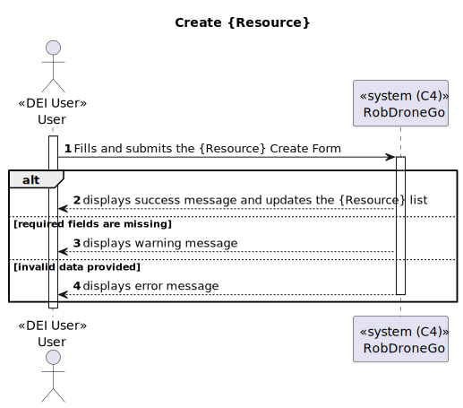

#### GET

#### PATCH

#### CREATE SIGNUP REQUEST

#### ACCEPT SIGNUP REQUEST
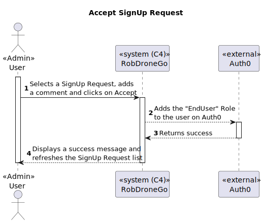

#### LOGIN / REDIRECT

---

### Level 2

#### Logical View

#### Implementation View

#### Physical View

- With the orange color we represent a component that is not part of the solution, but it will use RobDroneGo system.
- With the blue color we represent the components that are part of the system, and are supposed to be developed by the team.

#### Process View

##### POST
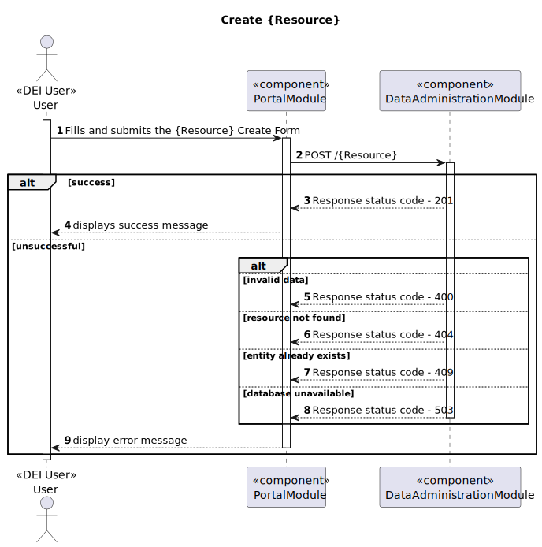

##### GET

##### PATCH

##### ACCEPT SIGNUP REQUEST
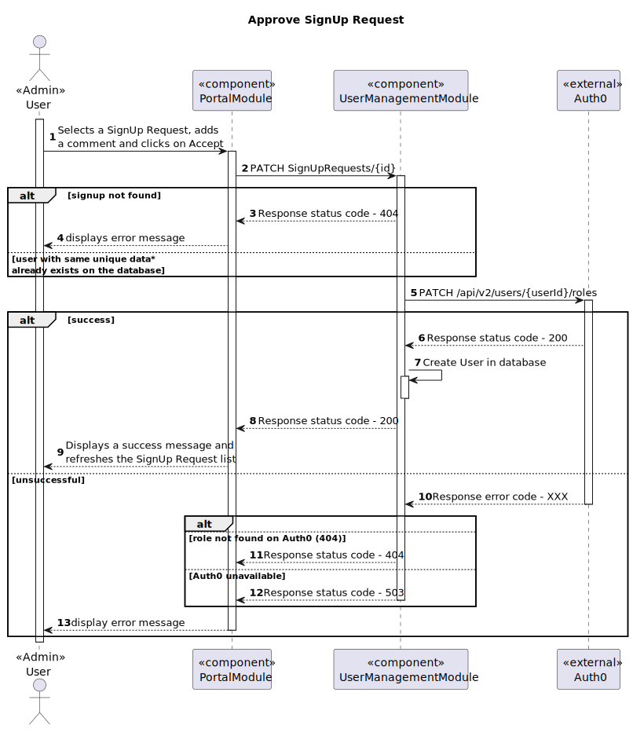

##### CREATE BACKOFFICE USER

---

### Level 3

#### Logical View - RobDroneGo Portal Module

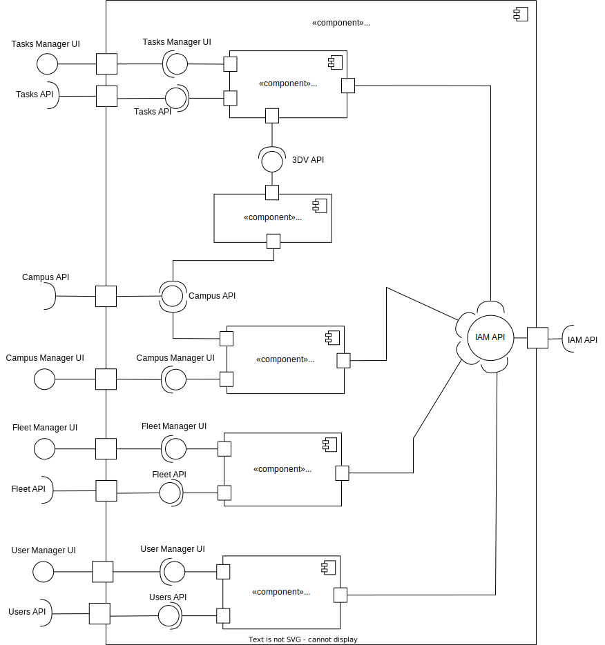

#### Implementation View - RobDroneGo Portal Module

#### Process View - RobDroneGo Portal Module

##### List All

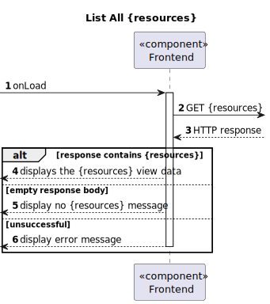

##### List Filter

##### Edit

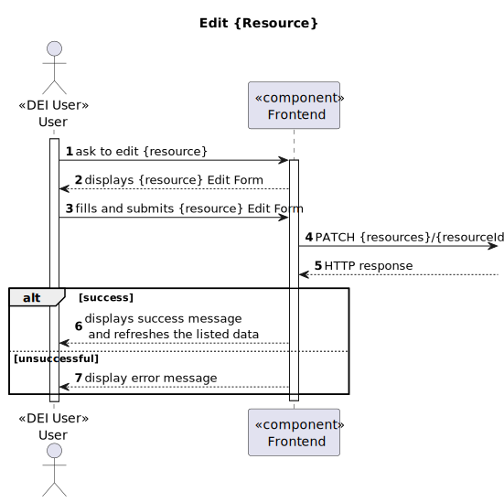

##### Create

---

#### Logical View - Data Administration Module

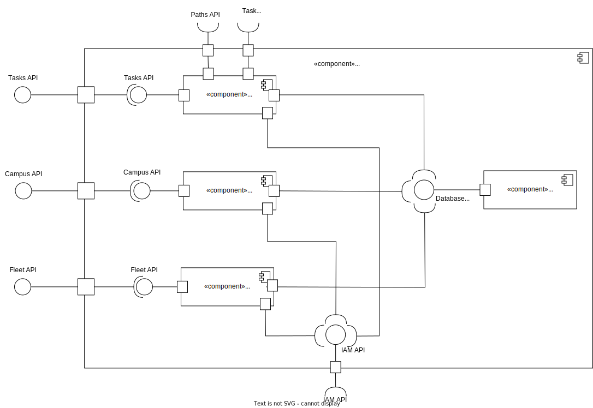

#### Implementation View - Data Administration Module

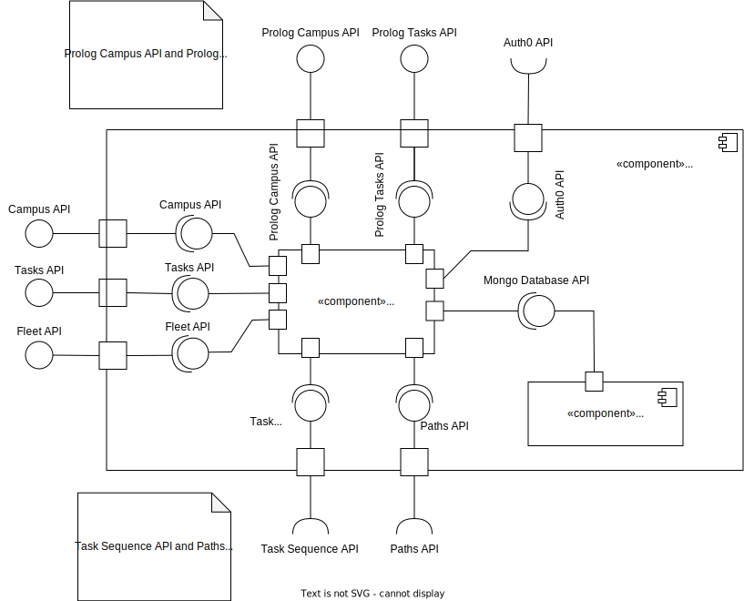

#### Process View - Data Administration Module

##### POST - Building

##### POST - Robisep

##### POST - Passage
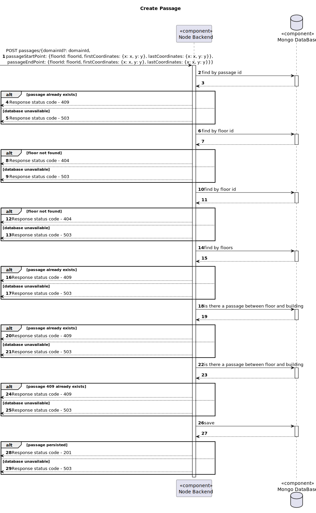

#### PATCH - Elevator

#### PATCH - Floor
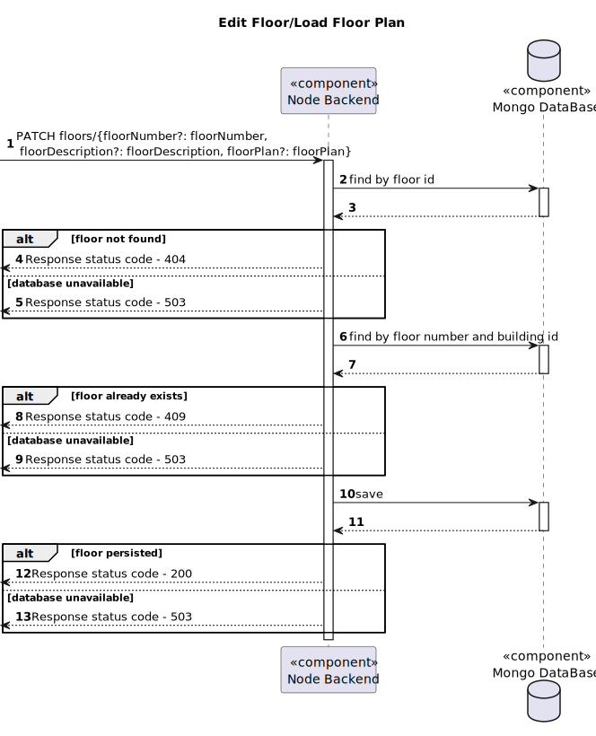

#### PATCH - Passage
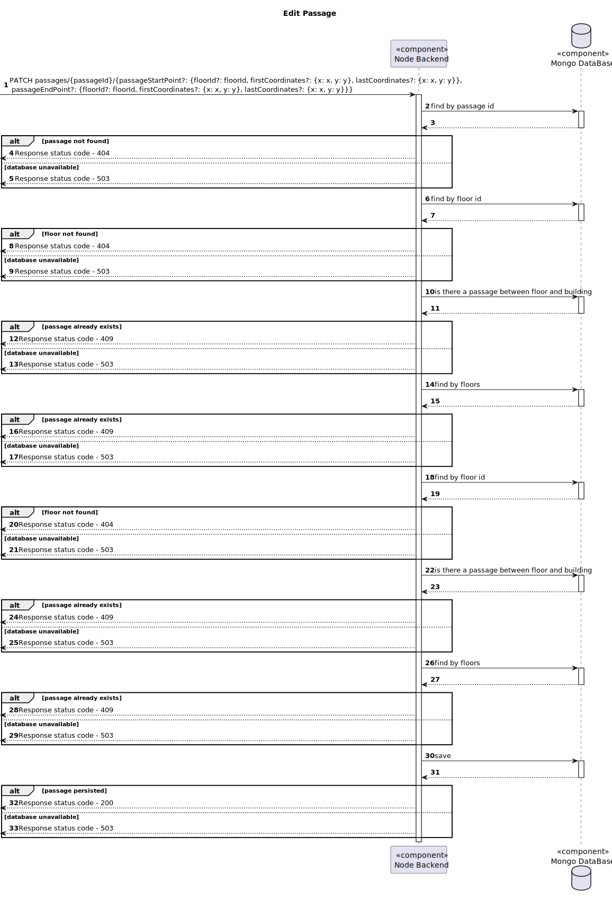

##### PATCH - Robisep
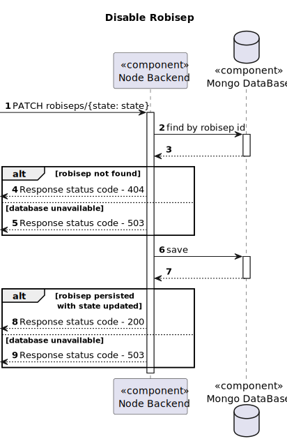

##### GET - Robisep

##### GET - Passage

##### GET - Task Sequence

---

#### Logical View - Planning Module

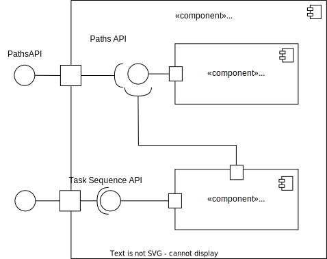

#### Implementation View - Planning Module

#### Process View - Planning Module

##### List - Paths

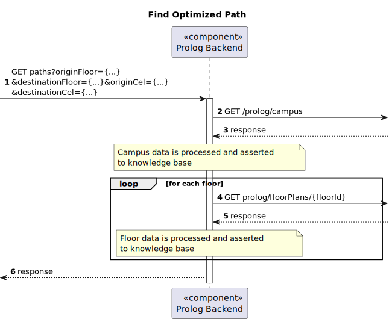

##### List - Task Sequence

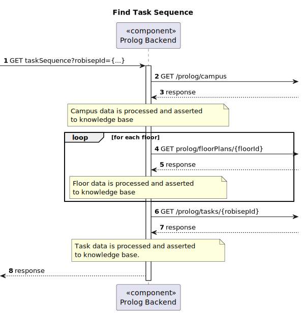

---

#### Logical View - User Management Module

#### Implementation View - User Management Module

#### Process View - User Management Module

##### CREATE BACKOFFICE USER

##### ACCEPT SIGNUP REQUEST
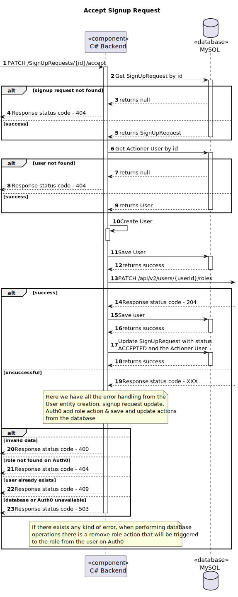